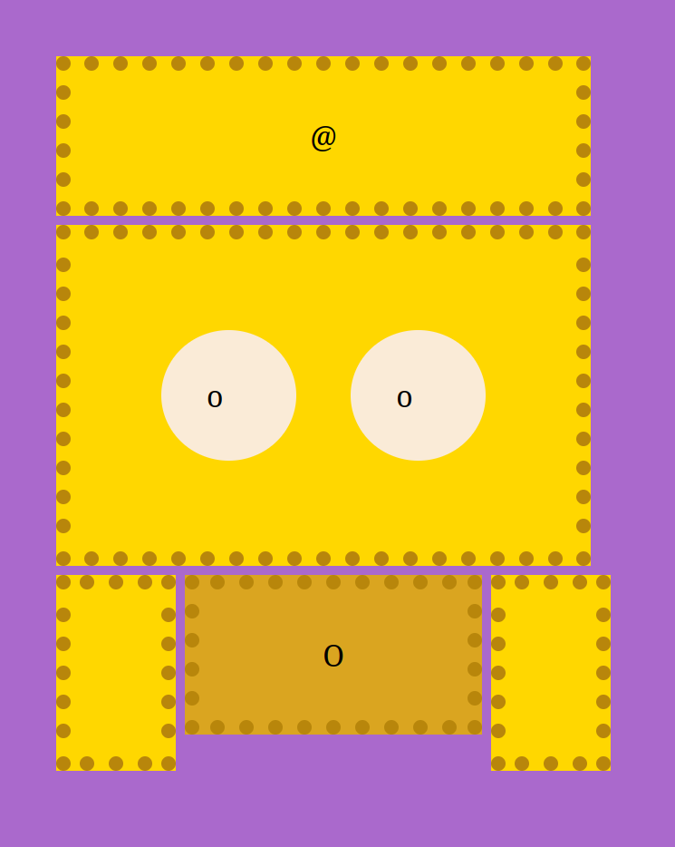
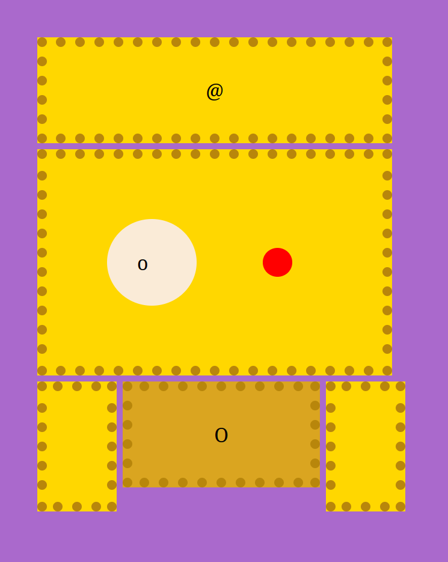
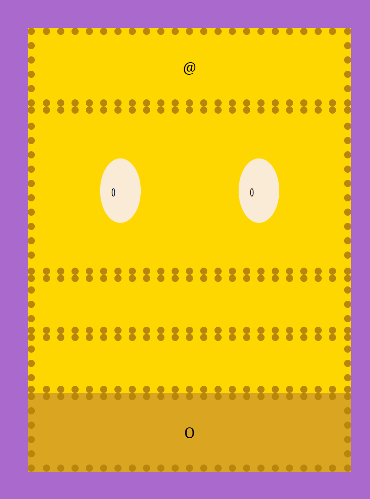
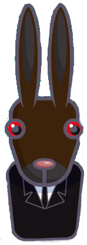
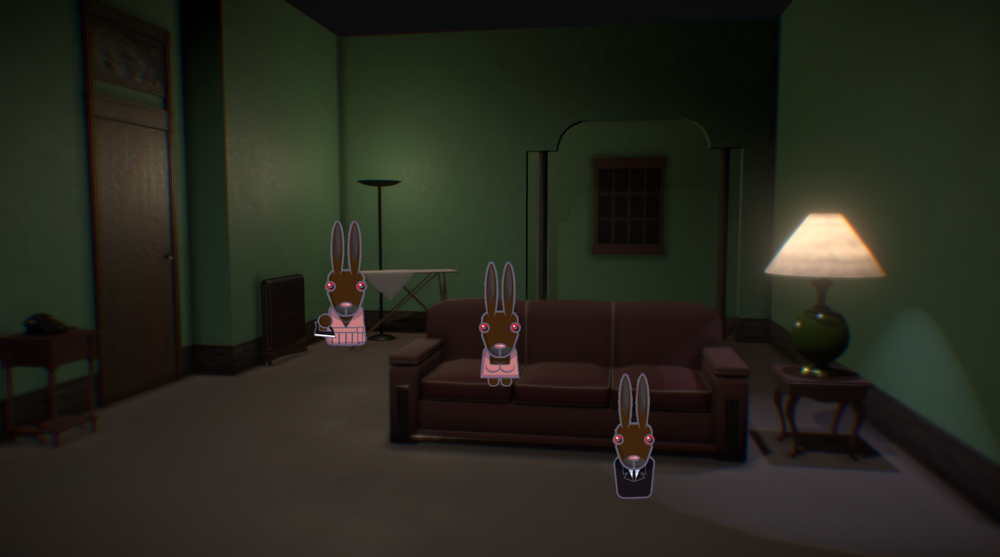
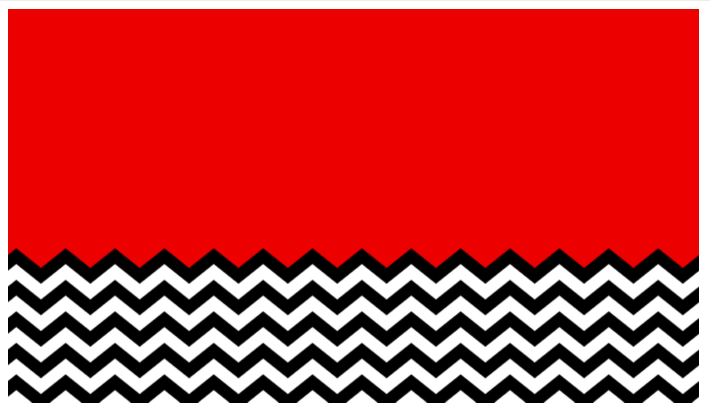
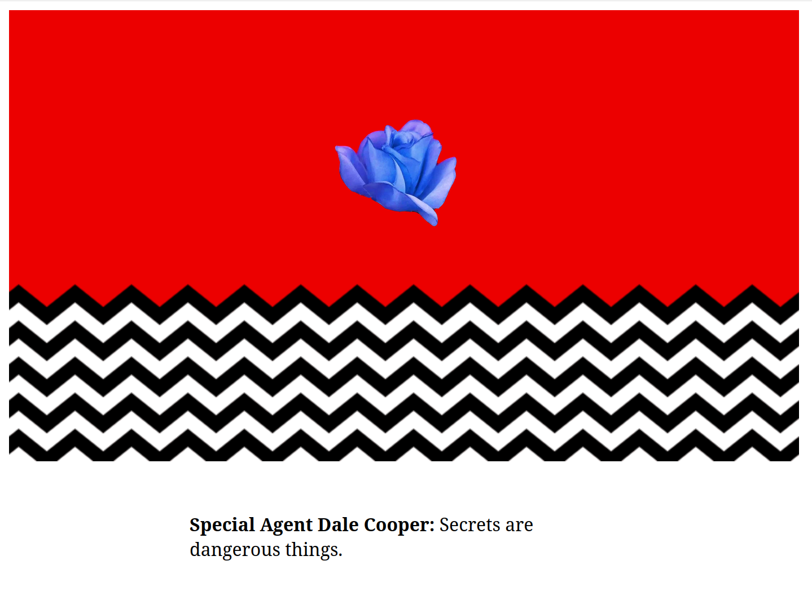

# Examen 28 ianuarie 2025

Încărcați rezolvările (toate fișierele folosite în rezolvări, inclusiv fișierele furnizate pe această pagină) într-o arhivă .zip cu numele de forma `nrgrupa_nume_prenume.zip` la [această adresă de dropbox](https://www.dropbox.com/request/fCiXNee4W90SiWKNL8cJ). Toate subiectele sunt obligatorii. Condiția de promovare a examinării este obținerea a 3 puncte din 6.

## A. uite coiful! layout, tranziții, media query (1.5 puncte)

1. Scrieți un fișier HTML `coif.html` care să conțină un div cu clasa `container`. În interiorul lui, adăugați încă alte 7 divuri. Creați un fișier `coif.css` în care să adăugați reguli CSS astfel încât pagina să arate ca în imaginea de mai jos și:
- fiecare coloană să aibă lățimea de 55px
- spațiul dintre linii și coloane să fie de 5px
- divurile să aibă padding de 25px
- textul să fie centrat pe orizontală
- divurile (mai puțin cercurile) vor avea fundal de culoare `Gold` ori `DarkGoldenrod` (divul cu simbolul O), textul colorat cu negru și border `DarkGoldenrod`, punctat, de 8px
- divurile în formă de cerc nu vor avea border și vor avea fundal `AntiqueWhite`.

2. Adăugați reguli CSS astfel încât la ținerea apăsată a mouse-ului pe un div în formă de cerc
- divul va avea fundal (și text) `Red`
- se va micșora la o treime din mărimea inițială, treptat, într-o tranziție de 0.45 secunde.
 

3. Scrieți un media query pentru ferestre cu lățimea între 333px și 622px astfel încât divurile să nu mai fie afișate cu layoutul de mai sus, ci în formatul default, unele sub altele, ocupând întreaga lățime a containerului, precum în imaginea de mai jos. De asemenea, cercurile vor fi micșorate la jumătate pe orizontală.

##  Rabbits. events, DOM, sessionStorage (2.5 puncte)

4. Scrieți un fișier HTML `rabbits.html` care să aibă ca fundal (pe întreaga suprafața a ferestrei) imaginea din fișierul `rabbits.png` din directorul `resources/images`. Adăugați cod JavaScript în fișierul `rabbits.js` astfel încât să creați un mic joc cu iepuri inspirat de filmul lui David Lynch, "Rabbits". 

5. La apăsarea tastei `r` va apărea pe ecran, la o poziție aleatoare, o imagine cu un iepure: folosiți fișierul `rabbit-01.png` din directorul `resources/images`.

6. La apăsarea unui iepure de pe ecran, acesta se va metamorfoza. Imaginea iepurelui se va schimba, fiind înlocuită pe rând, la fiecare click, cu una din imaginile `rabbit-02.png` și `rabbit-03.png` din directorul `resources/images`, iar apoi va dispărea. 

7. La apăsarea tastei `p`, iepurii încep să se miște: se vor deplasa aleator pe pagină (pot ieși din ecran). Hint: folosiți `setInterval`. La apăsarea tastei `s`, se opresc: nu se mai mișcă niciun iepure. La apăsarea tastei `a`, va fi cântat sunetul din fișierul `rabbits-ambience.mp3` din directorul `resources`.

8. Salvați în `sessionStorage` numărul de iepuri creați în total și afișați-l cu alb în colțul din dreapta sus a ecranului.

## C. Twin Peaks: the black lodge. events, canvas, fetch (2 puncte)

9.  Scrieți un fișier HTML `lodge.html` astfel încât să desenați, folosind fie elementul `canvas` (și cod JavaScript), fie cod SVG, fie cod CSS, the black lodge din filmul Twin Peaks, ca în imaginea de mai jos.

Dacă nu știți să desenați imaginea folosind canvas, SVG sau CSS, puteți folosi fișierul 'resources/images/black-lodge.png' pentru a continua rezolvarea subiectului (cu punctaj parțial, pentru neîndeplinirea primei cerințe).

10. Adăugați peste acest desen (cu cod JavaScript) trandafirul albastru din fișierul 'resources/images/rose.webp`, ca în imaginea de mai jos.

La apăsarea trandafirului, se va alege un citat din lista din fișierul `quotes.json`. Folosiți fetch și promisiuni pentru a accesa conținutul fișierului pe un server http local (porniți un server http folosind, de exemplu, Python, cu comanda `python3 -m http.server 5000`). La fiecare click pe trandafir, se va alege aleator un citat și se vor afișa sub desen personajul și replica conținute în câmpurile `character` și `quote`.

11. La trecerea cu mouse-ul deasupra unui citat, se vor afișa sub acesta sezonul și episodul din Twin Peaks în care a apărut.

