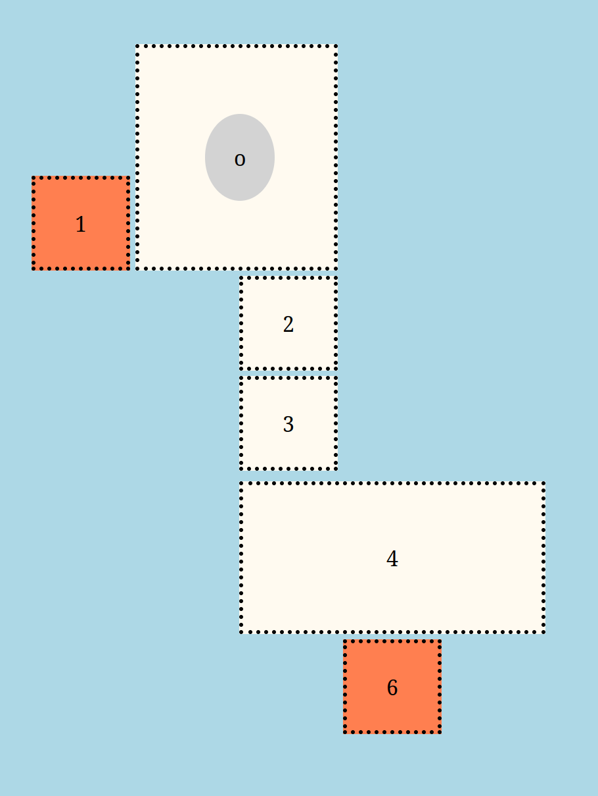
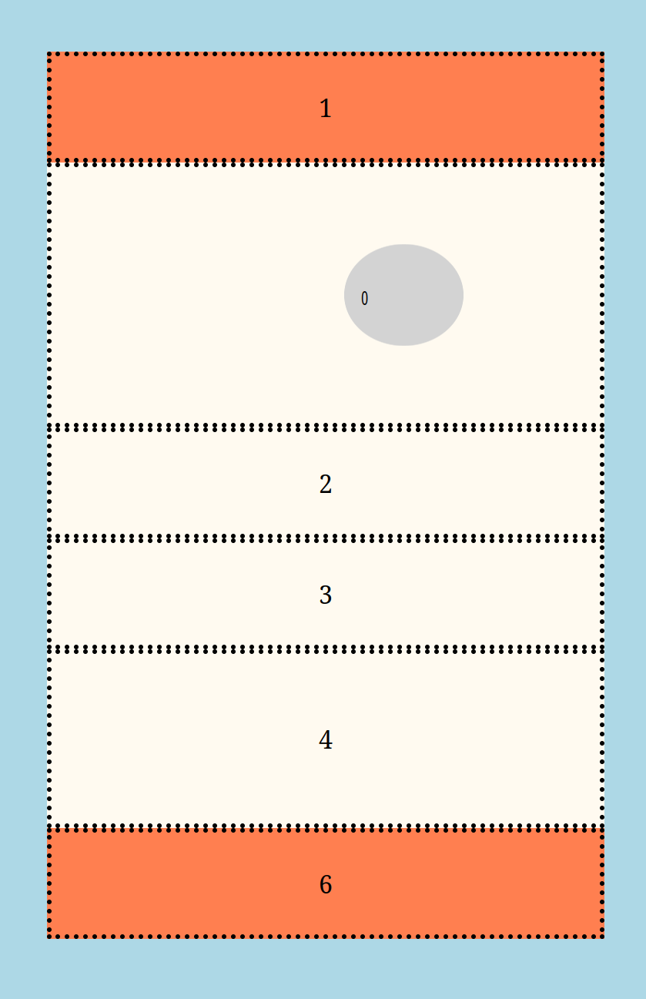
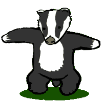
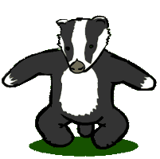
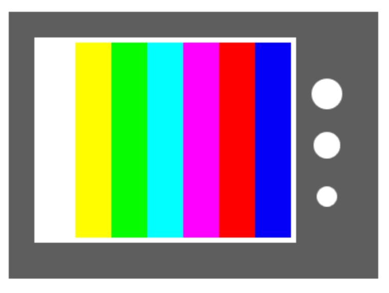
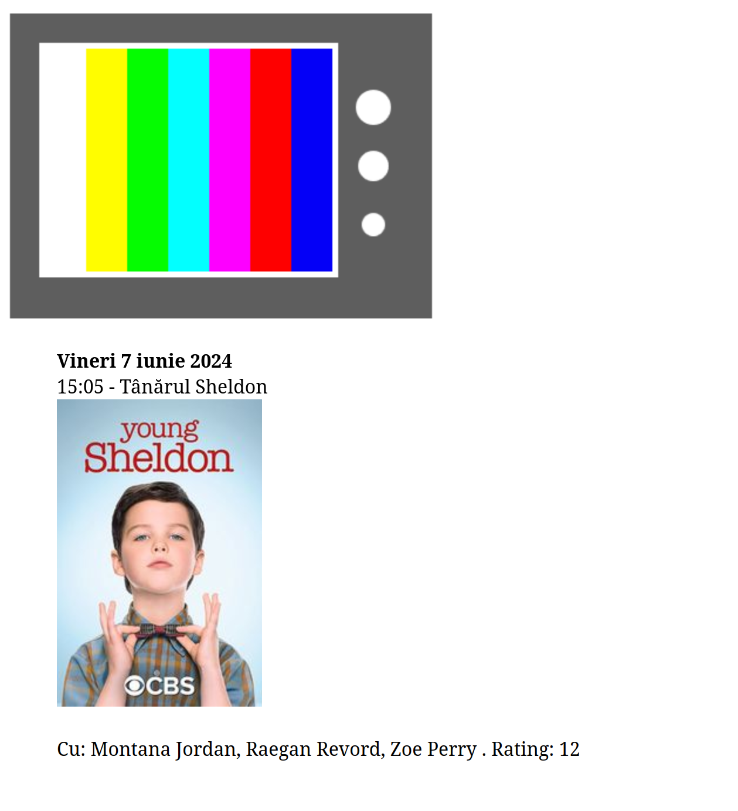

# Examinare 7 iunie 2024

Trimiteți rezolvările (toate fișierele folosite în rezolvări, inclusiv fișierele furnizate pe această pagină) într-o arhivă .zip cu numele de forma `nrgrupa_nume_prenume.zip` la adresa `claudia-elena.chirita@unibuc.ro` într-un mail cu subiectul `Test Tehnici Web 7 iunie`. Toate subiectele sunt obligatorii. Condiția de promovare a examinării este obținerea a 3 puncte din 6.

## A. layout, tranziții, media query (1.5 puncte)
1. Scrieți un fișier HTML `bird.html` care să conțină un div cu clasa `container`. În interiorul lui, adăugați încă alte 8 divuri. Creați un fișier `bird.css` în care să adăugați reguli CSS astfel încât pagina să arate ca în imaginea de mai jos și:
- fiecare coloană să aibă lățimea de 75px
- spațiul dintre linii și coloane să fie de 4px
- divurile să aibă padding de 22px
- textul să fie centrat pe orizontală
- divurile (mai puțin cercul) vor avea fundal `FloralWhite` ori `Coral` (picioarele și ciocul), textul colorat cu negru și border negru, punctat, de 4px
- divul în formă de cerc nu va avea border și va avea fundal `LightGray`.

2. Folosiți cunoștințele dobândite la cursul de baze de date pentru a identifica pasărea din desenul de mai sus. Adăugați un comentariu în pagina html cu numele speciei identificate de voi.

3. Adăugați reguli CSS astfel încât la trecerea mouse-ului deasupra divului în formă de cerc
- divul va avea fundal (și text) `Crimson`
- se va micșora la o treime din mărimea inițială, treptat, într-o tranziție de 0.3 secunde.
 

4. Scrieți un media query pentru ferestre cu lățimea între 350px și 600px astfel încât divurile să nu mai fie afișate cu layoutul de mai sus, ci în formatul default, unele sub altele, ocupând întreaga lațime a containerului, precum în imaginea de mai jos. De asemenea, cercul va fi micșorat la jumătate pe orizontală.

## B. badger! badger! badger!: events, DOM, localStorage (2.5 puncte)

5. Scrieți un fișier HTML `badger.html` care să conțină un body gol și să încarce fișierul de stil `badger.css` pe care îl puteți găsi în directorul `resources`. Adăugați cod JavaScript în fișierul `badger.js` astfel încât să creați un mic joc cu bursuci. 

La apăsarea tastei `b` va apărea pe ecran, la o poziție aleatoare, un bursuc: folosiți imaginea `badger-1.png` din directorul `resources/images`.

6. La apăsarea unui bursuc de pe ecran, acesta va începe să danseze. Imaginea bursucului se va schimba, pe rând, la interval de 0.2 secunde cu imaginile `badger-2.png`, `badger-3.png`, `badger-4.png`, și iar `badger-1.png` din directorul `resources/images`. Imaginea va rămâne neschimbată pentru o secundă, apoi bursucul va face iar o genuflexiune, și tot așa. La apăsarea bursucului din nou, acesta va dispărea.

7. La apăsarea tastei `p`, va fi cântat ('played') sunetul `badger.mp3` furnizat în directorul `resources/sounds`. Hint: folosiți elementul html `audio` (încărcat dinamic cu JavaScript).

5. Salvați în `localStorage` numărul de genuflexiuni făcute în total de bursuci și afișați-l în colțul din dreapta sus. La fiecare 5 genuflexiuni, adăugați o ciupercă (folosind imaginea `mush.png` din directorul `resources/images`) pe ecran.

## C. zap! events, canvas, fetch (2 puncte)

9. Scrieți un fișier HTML `zap.html` astfel încât să desenați, folosind fie elementul `canvas` (și cod JavaScript), fie SVG, fie cod CSS, un televizor ca în imaginea de mai jos.

Dacă nu știți să desenați televizorul folosind canvas, SVG sau CSS, puteți folosi imaginea `resources/images/tv.png` pentru a continua rezolvarea subiectului (cu punctaj parțial, pentru neîndeplinirea primei cerințe).

10. La apăsarea televizorului, se va alege un film din lista din fișierul `zap.json`. Folosiți fetch și promisiuni pentru a accesa conținutul fișierului pe un server http local (porniți un server http folosind, de exemplu, Python, cu comanda `python3 -m http.server 5000`). La fiecare click pe televizor, se va alege aleator un film și se vor afișa sub televizor data și ora la care va fi difuzat filmul, titlul și posterul acestuia (imaginea de la pathul salvat în câmpul `poster`). 

11. La trecerea cu mouse-ul deasupra unui film, se vor afișa sub poster informații suplimentare despre film: distribuția și ratingul.

