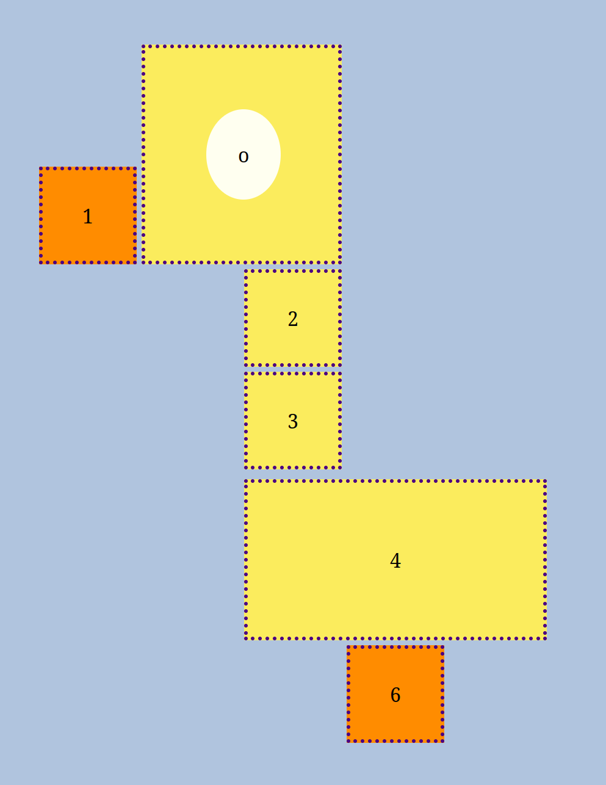
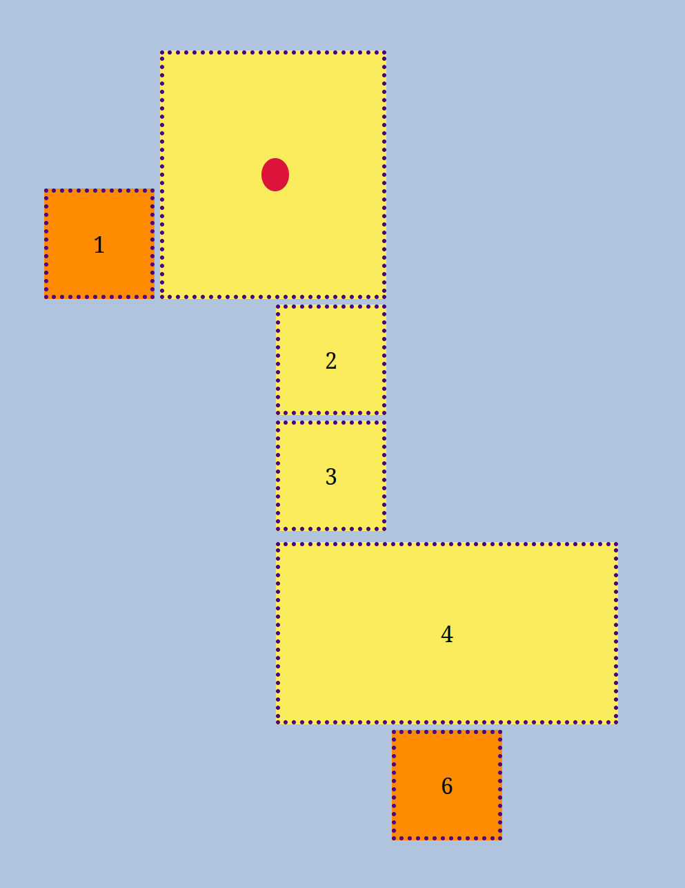
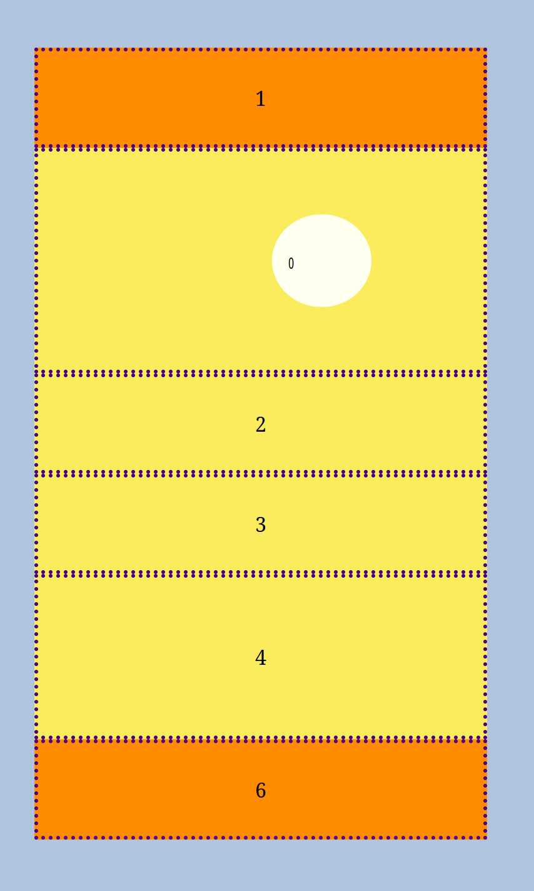
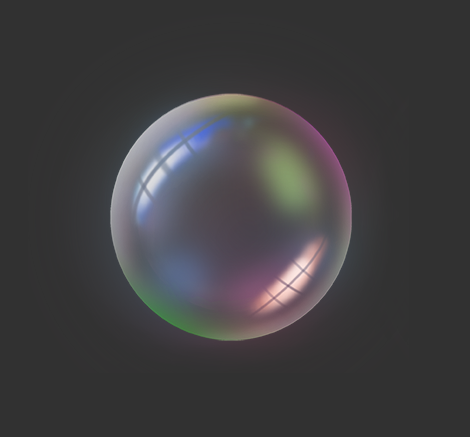
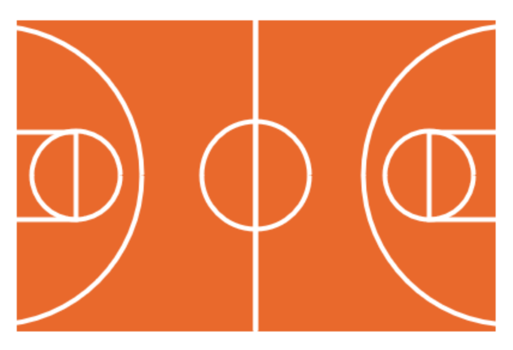
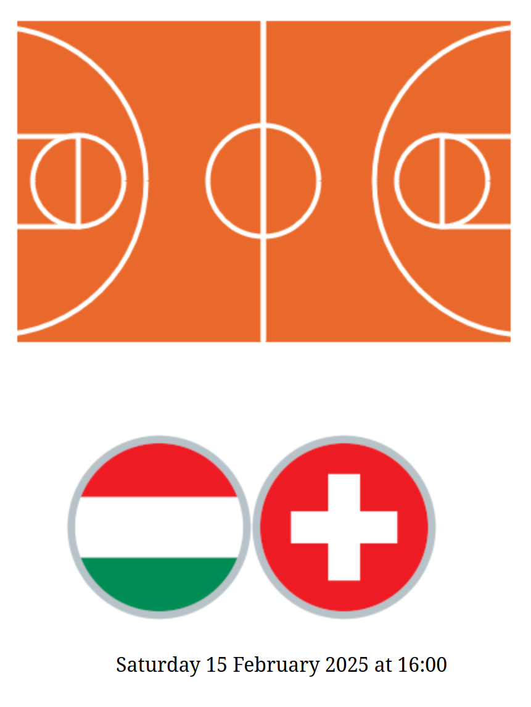

# Examen 27 ianuarie 2025

Încărcați rezolvările (toate fișierele folosite în rezolvări, inclusiv fișierele furnizate pe această pagină) într-o arhivă .zip cu numele de forma `nrgrupa_nume_prenume.zip` la [această adresă de dropbox](https://www.dropbox.com/request/1msuAqu6DRq2r49G7kaN). Toate subiectele sunt obligatorii. Condiția de promovare a examinării este obținerea a 3 puncte din 6.

## A. layout, tranziții, media query (1.5 puncte)

1. Scrieți un fișier HTML `sher.html` care să conțină un div cu clasa `container`. În interiorul lui, adăugați încă alte 8 divuri. Creați un fișier `sher.css` în care să adăugați reguli CSS astfel încât pagina să arate ca în imaginea de mai jos și:
- fiecare coloană să aibă lățimea de 80px
- spațiul dintre linii și coloane să fie de 4px
- divurile să aibă padding de 26px
- textul să fie centrat pe orizontală
- divurile (mai puțin cercul) vor avea fundal de culoare `#fbec5d` ori `DarkOrange` (picioarele și ciocul), textul colorat cu negru și border `Indigo`, punctat, de 3px
- divul în formă de cerc nu va avea border și va avea fundal `Ivory`.

2. Adăugați reguli CSS astfel încât la ținerea apăsată a mouse-ului pe divul în formă de cerc
- divul va avea fundal (și text) `Crimson`
- se va micșora la o treime din mărimea inițială, treptat, într-o tranziție de 0.4 secunde.
 

3. Scrieți un media query pentru ferestre cu lățimea între 330px și 620px astfel încât divurile să nu mai fie afișate cu layoutul de mai sus, ci în formatul default, unele sub altele, ocupând întreaga lățime a containerului, precum în imaginea de mai jos. De asemenea, cercul va fi micșorat la jumătate pe orizontală.

BONUS: Identificați pasărea din desenul de mai sus. Adăugați un comentariu în pagina html cu numele păsării identificate de voi.

## burst! the bubble: events, DOM, localStorage (2.5 puncte)

4. Scrieți un fișier HTML `soap.html` care să conțină un body gol și să încarce fișierul de stil `soap.css` pe care îl puteți găsi în directorul `resources`. Adăugați cod JavaScript în fișierul `soap.js` astfel încât să creați un mic joc cu baloane de săpun. 

5. La apăsarea tastei `s` va apărea pe ecran, la o poziție aleatoare, un balon de săpun: folosiți imaginea `bubble-1.png` din directorul `resources/images`.

6. La apăsarea unui balon de pe ecran, acesta sa va 'sparge'. Imaginea balonului se va schimba, fiind înlocuită pe rând cu imaginile `bubble-2.png`, `bubble-3.png`, `bubble-4.png` din directorul `resources/images`, iar apoi va dispărea.

7. La apăsarea tastei `p`, baloanele încep să plutească în toate direcțiile: se vor deplasa aleator pe pagină (pot ieși din ecran). Hint: folosiți `setInterval`. La apăsarea tastei `f`, se opresc toate: baloanele nu se mai mișcă. 

8. Salvați în `sessionStorage` numărul de baloane sparte în total și afișați-l în colțul din dreapta sus a ecranului.

## C. woop-woop thru the hoop! events, canvas, fetch (2 puncte)

9. Scrieți un fișier HTML `fibacup.html` astfel încât să desenați, folosind fie elementul `canvas` (și cod JavaScript), fie SVG, fie cod CSS, un teren de basket ca în imaginea de mai jos.

Dacă nu știți să desenați terenul folosind canvas, SVG sau CSS, puteți folosi imaginea 'resources/images/court.png' pentru a continua rezolvarea subiectului (cu punctaj parțial, pentru neîndeplinirea primei cerințe).

10. FIBA World Cup: La apăsarea terenului de basket, se va alege un meci din lista din fișierul `fibacup.json`. Folosiți fetch și promisiuni pentru a accesa conținutul fișierului pe un server http local (porniți un server http folosind, de exemplu, Python, cu comanda `python3 -m http.server 5000`). La fiecare click pe terenul de basket, se va alege aleator un meci și se vor afișa sub teren steagurile (imaginile al căror path este salvat în câmpurile `homeflag` și `guestflag`) țărilor celor două echipe care joacă meciul, iar sub imagini, data și ora la care va avea loc meciul.

11. La trecerea cu mouse-ul deasupra unui steag, se va afișa sub informațiile despre meci țara căreia îi corespunde.

